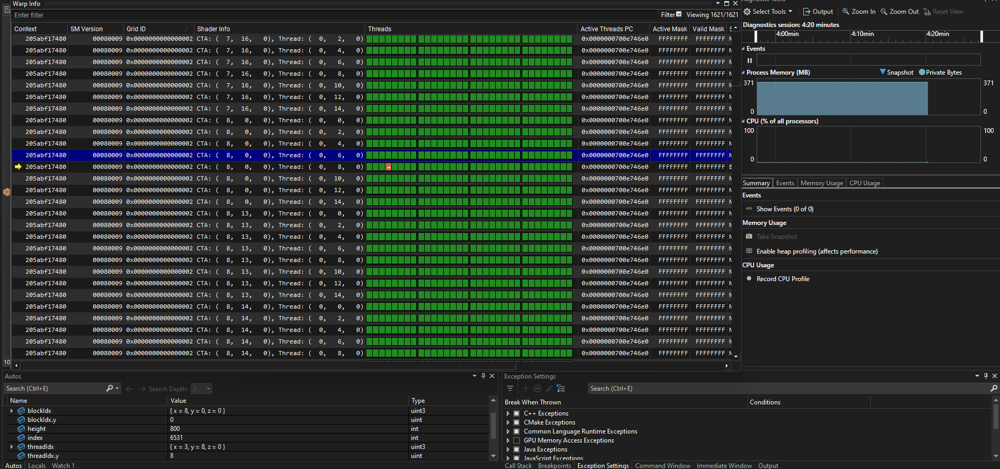
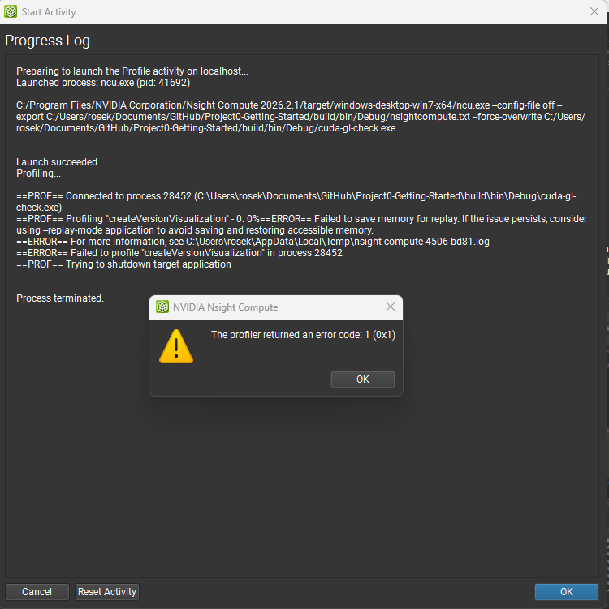
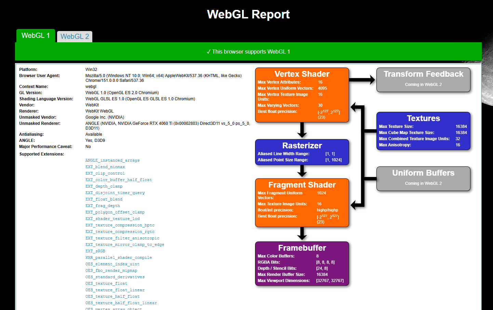
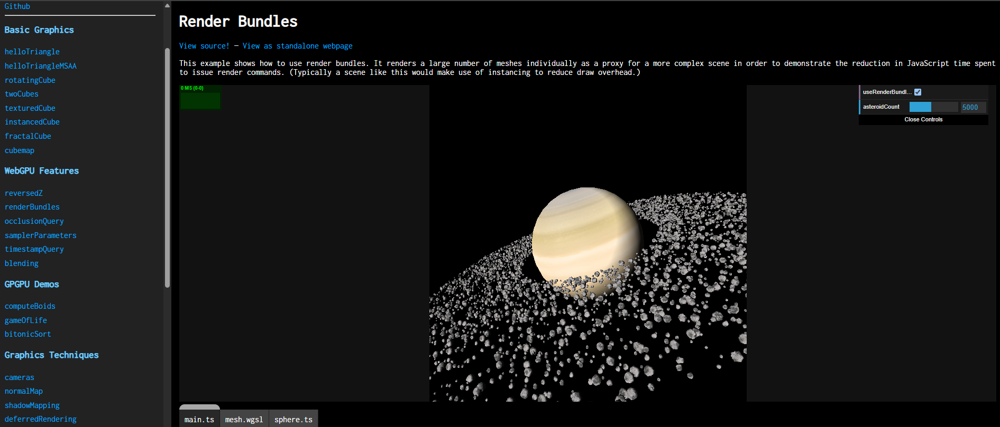

Project 0 Getting Started
====================

**University of Pennsylvania, CIS 5650: GPU Programming and Architecture, Project 0**

* Rose Kelly
  * (TODO) [LinkedIn](), [personal website](), [twitter](), etc.
* Tested on: Windows 11, i7-13700F @ 2.10 GHz 16GB, RTX 4060-Ti 8GB (Personal Computer)

### (TODO: Your README)

Include screenshots, analysis, etc. (Remember, this is public, so don't put
anything here that you don't want to share with the world.)

#### Part 2.1.2: Modify the CUDA Project and Take a Screenshot

#### Nsight Debugging on Windows using Nsight Visual Studio Edition

#### Nsight Systems on Windows

#### Nsight Compute on Windows

#### Part 2.2: Project Instructions - WebGL

#### Part 2.3: Project Instructions - WebGPU
