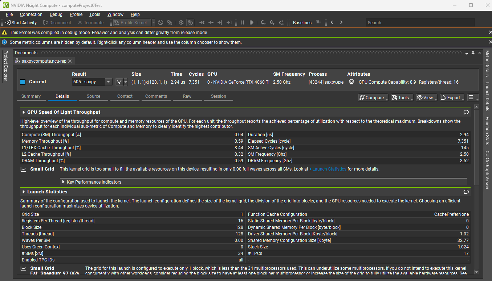
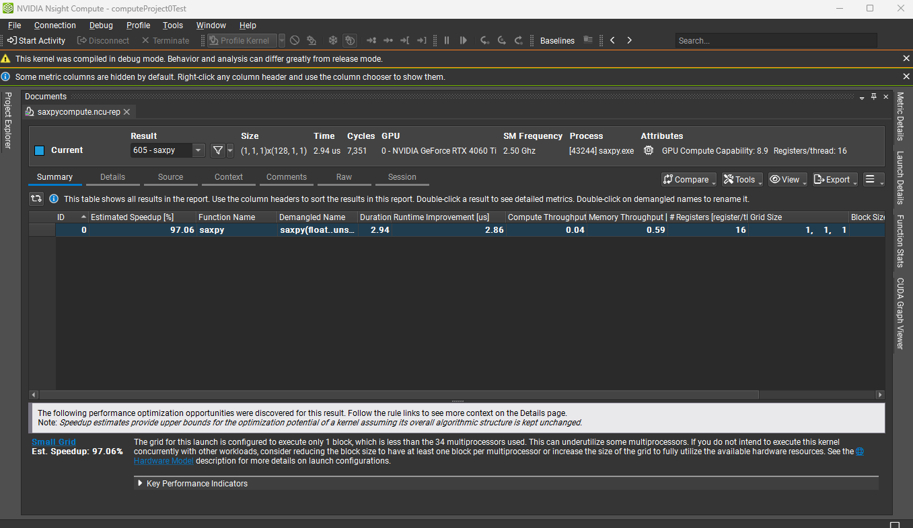

Project 0 Getting Started
====================

**University of Pennsylvania, CIS 5650: GPU Programming and Architecture, Project 0**

* Rose Kelly
  * [LinkedIn](www.linkedin.com/in/rose-kelly-b480b01a8)
* Tested on: Windows 11, i7-13700F @ 2.10 GHz 16GB, RTX 4060-Ti 8GB (Personal Computer)

#### Modify the CUDA Project and Take a Screenshot

#### Nsight Debugging on Windows using Nsight Visual Studio Edition

#### Nsight Systems on Windows

#### Nsight Compute on Windows

#### WebGL

#### WebGPU

